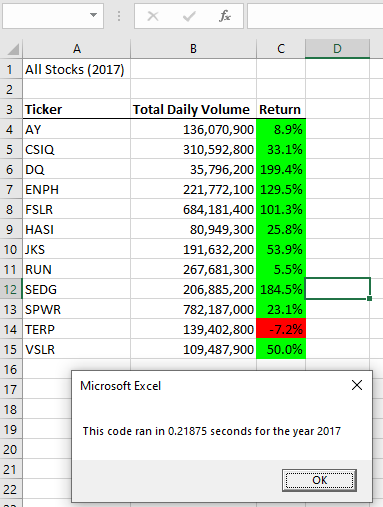
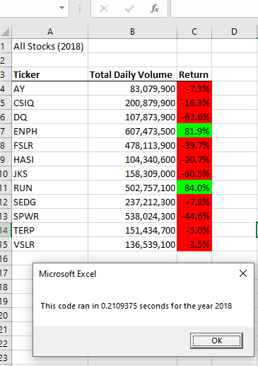
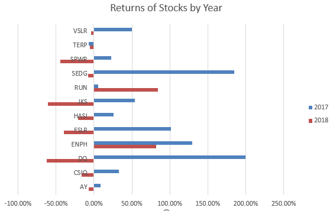

# Stock-Analysis
###### Using VBA and Excel to analyze data from green alternative energy stocks

## Overview
We use VBA code and Excel to help a client (and his parents) visualize and analyze the success of various green energy companies.  We do this by analyzing the performance of various companys' stocks over the years.

At the same time, we analyze the efficeincy and execution of our own VBA code, ensuring ease-of-use, versatility, and accessability.  We want our client to be able to analye the data, as well as any possible future data sets, with the push of a button.

## Results
### 2017 Analysis

In the table above, we can see a set of 12 stocks, how much each company has traded, and the yearly return of each.  The yearly return is determined by comparing the value of the stock at the begining of the year with its value at the end.  This is presented as a ratio, converted to percent.  Using color-coordinated formatting, we can easily see 2017 was a good year for these alternative energy stocks.  Each one appreciated in value, with the single exception of TERP.

We also see this analysis took a little over 0.2 seconds to run.

### 2018 Analysis

In this table, we see the same analysis of the same stocks as examined earlier, but for the year 2018.  Over this year, almost all stocks dropped in value.  The only two to enjoy positive returns are ENPH and RUN.

We also see this analysis took a little over 0.2 seconds to run.

### Conclusions and Comparison

This graphs help further visalize the performance of these stocks from year to year.  We can clearly see from the tables and graph above that most of these stocks will be risky investments.  While many stocks were hit with large negative gains in 2018, only SPWR and JKS seem to have enough negative gain to offset their respective positive gains from 2017.  That is to say, across both of the two years, only these two dropped in overall returns.  However, the 10 remaining stocks are not necessarily safe investments.

The only stocks to gain in both years were RUN and ENPH. And while ENPH has large gains in both years, it is RUN which seems to enjoy the biggest change in positive gains across the entire data set.  This may suggest that positive returns will diminish in the future for even ENPH.  RUN, on the other hand, may still be growing.
Both appear to be safe investments.

### Performance of Code
The original VBA code in these analyses ran an embedded loop through all the data over and over for each company, and generating outputs as it ran.  This process took about one whole second for each year.

The refactored code, on the other hand, runs through the data and stores values in arrays as it does so.  It becomes simple, then, to print a series of arrays.  This process (as seen above) took a little over 0.2 seconds for each year.

## Summary

### Why Refactor Code?
Refactoring code is very useful for improving code, making it more efficient and readable.  With a little work, code can be made to run more quickly, or to be repurposed more easily.
In addition, it is much easier on a coder to use code that has already been written and proven to work, rather than having to write code from scratch every time.

### Benefits of Refactoring in This Analysis
In this analysis, the code took 5 times as long to execute before refactoring.  It will be much easier to expand this dataset with more dates, more tickers, and more years.

